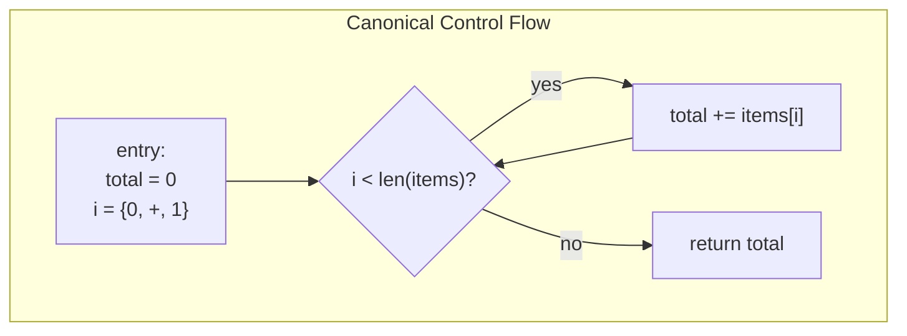

<div align="center">

# Semantic Firewall

### Behavioral Code Analysis Engine for Go

[](https://pkg.go.dev/github.com/BlackVectorOps/semantic_firewall)
[](LICENSE)
[](https://github.com/marketplace/actions/semantic-firewall)
[](https://github.com/BlackVectorOps/semantic_firewall/actions/workflows/semantic-check.yml)

**Fingerprint behavior, not bytes** · **Prove loop equivalence** · **Catch backdoors** · **Hunt malware**

</div>

---

> [!CAUTION]
> **Disclaimer:** This tool is provided for **defensive security research and authorized testing only**. The malware scanning features are designed to help security teams detect and analyze malicious code patterns. Do not use this tool to create, distribute, or deploy malware. Users are responsible for ensuring compliance with all applicable laws and organizational policies. The author assumes no liability for misuse.

---

## What is Semantic Firewall?

**Semantic Firewall** is a static analysis engine that generates deterministic fingerprints of Go code's **behavior**, not its textual representation. Unlike traditional diff tools that get confused by whitespace, renaming, or style changes, Semantic Firewall understands the actual control flow and data dependencies of your code.

**Core Capabilities:**

| Feature | Description |
|---------|-------------|
| **Scalar Evolution (SCEV)** | Mathematically proves loop equivalence regardless of syntax |
| **Semantic Zipper** | Diffs architectural changes by walking use-def chains in parallel |
| **BoltDB Signature Store** | ACID-compliant persistent storage with O(1) topology lookups |
| **Fuzzy Hash Indexing (LSH-lite)** | Locality-sensitive bucketing for near-match detection |
| **Shannon Entropy Analysis** | Detects obfuscation, packing, and encrypted payloads |
| **Topology Matching** | Catches renamed/obfuscated malware via structural fingerprints |

---

## Installation

```bash
go install github.com/BlackVectorOps/semantic_firewall/cmd/sfw@latest
```

## Quick Start

```bash
# Fingerprint a file (produces deterministic SHA-256 of behavior)
sfw check ./main.go

# Semantic diff between two versions (ignores cosmetic changes)
sfw diff old_version.go new_version.go

# Index a malware sample (auto-resolves DB location)
sfw index malware.go --name "Beacon_v1" --severity CRITICAL

# Scan code for known malware patterns (O(1) topology matching)
sfw scan ./suspicious/ --threshold 0.8

# Scan with dependency analysis (examines imported packages)
sfw scan ./cmd/myapp --deps --deps-depth transitive

# View database statistics
sfw stats
```

**Check Output:**
```json
{
  "file": "./main.go",
  "functions": [
    { "function": "main", "fingerprint": "005efb52a8c9d1e3...", "line": 12 }
  ]
}
```

**Diff Output (Risk-Aware):**
```json
{
  "summary": {
    "semantic_match_pct": 92.5,
    "preserved": 12,
    "modified": 1,
    "renamed_functions": 2,
    "high_risk_changes": 1
  },
  "functions": [
    {
      "function": "HandleLogin",
      "status": "modified",
      "added_ops": ["Call <log.Printf>", "Call <net.Dial>"],
      "risk_score": 15,
      "topology_delta": "Calls+2, AddedGoroutine"
    }
  ],
  "topology_matches": [
    {
      "old_function": "processData",
      "new_function": "handleInput",
      "similarity": 0.94,
      "matched_by_name": false
    }
  ]
}
```

**Scan Output (Malware Hunter):**
```json
{
  "target": "./suspicious/",
  "backend": "boltdb",
  "total_functions_scanned": 47,
  "alerts": [
    {
      "signature_name": "Beacon_v1",
      "severity": "CRITICAL",
      "matched_function": "executePayload",
      "confidence": 0.92,
      "match_details": {
        "topology_match": true,
        "entropy_match": true,
        "topology_similarity": 1.0,
        "calls_matched": ["net.Dial", "os.Exec"]
      }
    }
  ],
  "summary": { "critical": 1, "high": 0, "total_alerts": 1 }
}
```

---

## Why Use This?

> **"Don't unit tests solve this?"** No. Unit tests verify *correctness* (does input A produce output B?). `sfw` verifies *intent* and *integrity*.

- A developer refactors a function but secretly adds a network call → **unit tests pass, `sfw` fails**
- A developer changes a `switch` to a Strategy Pattern → **`git diff` shows 100 lines changed, `sfw diff` shows zero logic changes**
- An attacker renames a known malware function → **name-based detection fails, `sfw scan` catches it via topology**
- A supply chain attack adds obfuscated code → **entropy analysis flags it as PACKED**

| Traditional Tooling | Semantic Firewall |
|---------------------|-------------------|
| **Git Diff**: Shows lines changed (whitespace, renaming = noise) | **sfw check**: Verifies control flow graph identity |
| **Unit Tests**: Verify input/output (blind to side effects) | **sfw diff**: Isolates actual logic drift from cosmetic changes |
| **YARA/Grep**: Pattern matches strings (trivial to evade) | **sfw scan**: O(1) topology matching survives renaming/obfuscation |
| **Traditional AV**: Signature hashes (defeated by recompilation) | **sfw**: Behavioral fingerprints survive recompilation |

**Use cases:**
- **Supply chain security:** Detect backdoors like the xz attack that pass code review
- **Safe refactoring:** Prove your refactor didn't change behavior
- **CI/CD gates:** Block PRs that alter critical function logic
- **Malware hunting:** Index known malware patterns, scan codebases at scale
- **Obfuscation detection:** Entropy analysis flags packed/encrypted code
- **Dependency auditing:** Scan imported packages for malicious patterns

---

## Commands Reference

| Command | Purpose | Time Complexity | Space |
|---------|---------|-----------------|-------|
| `sfw check` | Generate semantic fingerprints | O(N) | O(N) |
| `sfw diff` | Semantic delta via Zipper algorithm | O(I) | O(I) |
| `sfw index` | Index malware samples into BoltDB | O(N) | O(1) per sig |
| `sfw scan` | Hunt malware via topology matching | **O(1) exact** / O(M) fuzzy | O(M) |
| `sfw migrate` | Migrate JSON signatures to BoltDB | O(S) | O(S) |
| `sfw stats` | Display database statistics | O(1) | O(1) |

Where N = source size, I = instructions, S = signatures, M = signatures in entropy range.

### Command Details

```bash
sfw check [--strict] [--scan --db <path>] <file.go|directory>
```
Generate semantic fingerprints. Use `--strict` for validation mode. Use `--scan` to enable unified security scanning during fingerprinting.

```bash
sfw diff <old.go> <new.go>
```
Compute semantic delta using the Zipper algorithm with topology-based function matching. Outputs risk scores and structural deltas.

```bash
sfw index <file.go> --name <name> --severity <CRITICAL|HIGH|MEDIUM|LOW> [--category <cat>] [--db <path>]
```
Index a reference malware sample. Generates topology hash, fuzzy hash, and entropy score.

```bash
sfw scan <file.go|directory> [--db <path>] [--threshold <0.0-1.0>] [--exact] [--deps] [--deps-depth <direct|transitive>]
```
Scan target code for malware signatures. Use `--exact` for O(1) topology-only matching. Use `--deps` to scan imported dependencies.

```bash
sfw migrate --from <json> --to <db>
```
Migrate legacy JSON database to BoltDB format for O(1) lookups.

### Signature Database Configuration

The CLI automatically resolves the signature database location (`signatures.db`) in the following order:

1.  **Explicit Flag:** `--db /custom/path/signatures.db`
2.  **Environment Variable:** `SFW_DB_PATH`
3.  **Local Directory:** `./signatures.db`
4.  **User Home:** `~/.sfw/signatures.db`
5.  **System Strings:** `/usr/local/share/sfw/signatures.db` or `/var/lib/sfw/signatures.db`

This allows you to manage updates independently of the binary.

```bash
sfw stats --db <path>
```
Display database statistics including signature count and index sizes.

---

## Proof of Equivalence: The SCEV Engine

> **Skeptical that this survives more than whitespace changes?**

The Semantic Firewall uses **Scalar Evolution (SCEV)** analysis to mathematically prove loop identity. SCEV represents induction variables as closed-form algebraic expressions called **Add Recurrences**.

**These three functions generate the IDENTICAL SHA-256 fingerprint:**

**1. Idiomatic Go (Range)**
```go
func sum(items []int) int {
    total := 0
    for _, x := range items {
        total += x
    }
    return total
}
```

**2. C-Style (Index)**
```go
func sum(items []int) int {
    total := 0
    for i := 0; i < len(items); i++ {
        total += items[i]
    }
    return total
}
```

**3. Raw Control Flow (Goto)**
```go
func sum(items []int) int {
    total := 0
    i := 0
loop:
    if i >= len(items) {
        goto done
    }
    total += items[i]
    i++
    goto loop
done:
    return total
}
```

**All three compile to the same canonical control flow:**



### The Add Recurrence Notation

The SCEV notation `{Start, +, Step}` represents an induction variable where at iteration $k$:

$$Val(k) = Start + (Step \times k)$$

So `{0, +, 1}` means "starts at 0, increments by 1 each iteration"; this algebraic representation is identical regardless of source syntax.

**SCEV is closed under affine transformations:**

| Operation | Result |
|-----------|--------|
| `{S, +, T} + C` | `{S+C, +, T}` |
| `C × {S, +, T}` | `{C×S, +, C×T}` |
| `{S₁, +, T₁} + {S₂, +, T₂}` | `{S₁+S₂, +, T₁+T₂}` |

**Verify it yourself:**
```bash
go run examples/proof.go

# Output:
# [Semantic Firewall Proof]
# 1. Range Loop Hash:  0a1b2c...
# 2. Index Loop Hash:  0a1b2c...
# 3. Goto Loop Hash:   0a1b2c...
# [SUCCESS] All three implementations are logically identical.
```

---

## Persistent Signature Database (BoltDB)

The scanner uses **BoltDB**, an embedded key-value store with ACID transactions, for signature storage. This enables:

- **O(1) exact topology lookups** via indexed hash keys
- **O(M) fuzzy matching** via range scans on entropy indexes
- **Atomic writes**: no partial updates on crash
- **Concurrent reads**: safe for parallel scanning
- **Zero configuration**: single file, no server required

### Database Schema

```
┌─────────────────────────────────────────────────────────────────┐
│                        BoltDB Buckets                           │
├─────────────────────────────────────────────────────────────────┤
│  signatures     │  ID → JSON blob (full signature)              │
│  idx_topology   │  TopologyHash → ID (O(1) exact match)         │
│  idx_fuzzy      │  FuzzyHash:ID → ID (LSH bucket index)         │
│  idx_entropy    │  "05.1234:ID" → ID (range scan index)         │
│  meta           │  version, stats, maintenance info             │
└─────────────────────────────────────────────────────────────────┘
```

### Entropy Key Encoding

Entropy scores are stored as fixed-width keys for proper lexicographic ordering:
```
Key: "05.1234:SFW-MAL-001"
      ├──────┤ ├─────────┤
      entropy  unique ID
```

This enables efficient range scans: find all signatures with entropy 5.0 ± 0.5.

### Database Operations

```bash
# View statistics
sfw stats --db signatures.db
{
  "signature_count": 142,
  "topology_index_count": 142,
  "entropy_index_size": 28672,
  "file_size_human": "2.1 MB"
}

# Migrate from legacy JSON (one-time operation)
sfw migrate --from old_signatures.json --to signatures.db

# Export for backup/compatibility
# (Programmatic API: scanner.ExportToJSON("backup.json"))
```

### Programmatic Database Access

```go
// Open database with options
opts := semanticfw.BoltScannerOptions{
    MatchThreshold:   0.75,    // Minimum confidence for alerts
    EntropyTolerance: 0.5,     // Fuzzy entropy window
    Timeout:          5*time.Second,
    ReadOnly:         false,   // Set true for scan-only mode
}
scanner, err := semanticfw.NewBoltScanner("signatures.db", opts)
defer scanner.Close()

// Add signatures (single or bulk)
scanner.AddSignature(sig)
scanner.AddSignatures(sigs)  // Atomic batch insert

// Lookup operations
sig, _ := scanner.GetSignature("SFW-MAL-001")
sig, _ := scanner.GetSignatureByTopology(topoHash)
ids, _ := scanner.ListSignatureIDs()
count, _ := scanner.CountSignatures()

// Maintenance
scanner.DeleteSignature("SFW-MAL-001")
scanner.MarkFalsePositive("SFW-MAL-001", "benign library")
scanner.RebuildIndexes()  // Recover from corruption
scanner.Compact("signatures-compacted.db")
```

---

## Malware Scanning: Two-Phase Detection

The Semantic Firewall includes a **behavioral malware scanner** that matches code by its structural topology, not just strings or hashes. The scanner uses a two-phase detection algorithm:

### Phase 1: O(1) Exact Topology Match

```
1. Extract FunctionTopology from target SSA function
2. Compute topology hash: SHA-256(blockCount || callProfile || controlFlowFlags)
3. BoltDB lookup: idx_topology[hash] → signature IDs
4. Return exact matches with 100% topology confidence
```

### Phase 2: O(1) Fuzzy Bucket Match (LSH-lite)

```
1. Compute fuzzy hash: GenerateFuzzyHash(topology) → "B3L1BR2"
2. Look up all signatures in the same fuzzy bucket
3. Verify call signature overlap and entropy distance
4. Return matches above confidence threshold
```

**Why this survives evasion:**

- **Renaming evasion fails**: `backdoor()` → `helper()` still matches (names aren't part of topology)
- **Obfuscation-resistant**: Variable renaming and code shuffling don't change block/call structure
- **O(1) at scale**: BoltDB indexes enable instant lookups even with thousands of signatures

### Fuzzy Hash Buckets (LSH-lite)

The fuzzy hash creates locality-sensitive buckets based on quantized structural metrics:

```
FuzzyHash = "B{log2(blocks)}L{loops}BR{log2(branches)}"

Examples:
  B3L1BR2 = 8-15 blocks, 1 loop, 4-7 branches
  B4L2BR3 = 16-31 blocks, 2 loops, 8-15 branches
```

Log2 buckets reduce sensitivity to small changes while preserving structural similarity.

### Dependency Scanning

Scan not just your code, but all imported dependencies:

```bash
# Scan local code + direct imports
sfw scan ./cmd/myapp --deps --db signatures.db

# Deep scan: include transitive dependencies
sfw scan . --deps --deps-depth transitive --db signatures.db

# Fast exact-match mode for large codebases
sfw scan . --deps --exact --db signatures.db
```

**Output with dependencies:**
```json
{
  "target": "./cmd/myapp",
  "total_functions_scanned": 1247,
  "dependencies_scanned": 892,
  "scanned_dependencies": [
    "github.com/example/suspicious-lib",
    "github.com/another/dependency"
  ],
  "alerts": [...],
  "summary": { "critical": 0, "high": 1, "total_alerts": 1 }
}
```

| Flag | Description |
|------|-------------|
| `--deps` | Enable dependency scanning |
| `--deps-depth direct` | Scan only direct imports (default) |
| `--deps-depth transitive` | Scan all transitive dependencies |
| `--exact` | O(1) exact topology match only (fastest) |

> **Note:** Dependency scanning requires modules to be downloaded (`go mod download`). Stdlib packages are automatically excluded.

### Workflow: Lab → Hunt


### Step 1: Index Known Malware (Lab Phase)

```bash
# Index a beacon/backdoor sample
sfw index samples/dirty/dirty_beacon.go \
    --name "DirtyBeacon" \
    --severity CRITICAL \
    --category malware \
    --db signatures.db

# Output:
{
  "message": "Indexed 1 functions from samples/dirty/dirty_beacon.go",
  "indexed": [{
    "name": "DirtyBeacon_Run",
    "topology_hash": "topo:9a8b7c6d5e4f3a2b...",
    "fuzzy_hash": "B3L1BR2",
    "entropy_score": 5.82,
    "identifying_features": {
      "required_calls": ["net.Dial", "os.Exec", "time.Sleep"],
      "control_flow": { "has_infinite_loop": true, "has_reconnect_logic": true }
    }
  }],
  "backend": "boltdb",
  "total_signatures": 1
}
```

### Step 2: Scan Suspicious Code (Hunter Phase)

```bash
# Scan an entire directory
sfw scan ./untrusted_vendor/ --db signatures.db --threshold 0.75

# Fast mode: exact topology match only (O(1) per function)
sfw scan ./large_codebase/ --db signatures.db --exact
```

---

## Shannon Entropy Analysis

The scanner calculates **Shannon entropy** for each function to detect obfuscation and packed code:

$$H = -\sum_{i} p(x_i) \log_2 p(x_i)$$

Where $p(x_i)$ is the probability of byte value $x_i$ appearing in the function's string literals.

**Entropy Spectrum:**

```
     LOW          NORMAL              HIGH         PACKED
  ◀─────────────────────────────────────────────────────────▶
  │    ░░░░░░░░░░░░░░░░░░░░░░░░░░░░░░░░░▓▓▓▓▓▓▓▓▓▓▓████████│
  0                  4.0              6.5        7.5        8.0
  │                   │                │          │          │
  │  Simple funcs     │  Normal code   │ Obfusc.  │ Encrypted│
  │  (getters/setters)│  (business     │ (base64  │ (packed  │
  │                   │   logic)       │  strings)│  payloads)│
```

| Entropy Range | Classification | Meaning | Example |
|--------------|----------------|---------|---------|
| < 4.0 | LOW | Simple/sparse code | `func Get() int { return x }` |
| 4.0 - 6.5 | NORMAL | Typical compiled code | Business logic, handlers |
| 6.5 - 7.5 | HIGH | Potentially obfuscated | Base64 blobs, encoded strings |
| > 7.5 | PACKED | Likely packed/encrypted | Encrypted payloads, shellcode |

Functions with HIGH or PACKED entropy combined with suspicious call patterns receive elevated confidence scores.

### Call Signature Resolution

The topology extractor resolves call targets to stable identifiers:

| Call Type | Resolution | Example |
|-----------|------------|---------|
| Static function | `pkg.Func` | `net.Dial` |
| Interface invoke | `invoke:Type.Method` | `invoke:io.Reader.Read` |
| Builtin | `builtin:name` | `builtin:len` |
| Closure | `closure:signature` | `closure:func(int) error` |
| Go statement | `go:target` | `go:handler.serve` |
| Defer statement | `defer:target` | `defer:conn.Close` |
| Reflection | `reflect:Call` | Dynamic dispatch |
| Dynamic | `dynamic:type` | Unknown target |

This stable resolution ensures signatures match even when:
- Code is moved between packages
- Interface implementations change
- Method receivers are renamed

---

## Topology Matching

The diff command now uses **structural topology matching** to detect renamed or obfuscated functions.

**How Topology Matching Works:**

```
┌─────────────────────────────────────────────────────────────────────────────┐
│                        TOPOLOGY FINGERPRINT EXTRACTION                       │
├─────────────────────────────────────────────────────────────────────────────┤
│                                                                             │
│   func processData(input []byte) error {        ──►  TOPOLOGY VECTOR        │
│       conn, _ := net.Dial("tcp", addr)                                      │
│       for _, b := range input {                      ┌──────────────────┐   │
│           conn.Write([]byte{b})                      │ Params: 1        │   │
│       }                                              │ Returns: 1       │   │
│       return conn.Close()                            │ Blocks: 4        │   │
│   }                                                  │ Loops: 1         │   │
│                                                      │ Calls:           │   │
│                                                      │   net.Dial: 1    │   │
│   func handleInput(data []byte) error {              │   Write: 1       │   │
│       c, _ := net.Dial("tcp", server)                │   Close: 1       │   │
│       for i := 0; i < len(data); i++ {               │ Entropy: 5.2     │   │
│           c.Write([]byte{data[i]})                   └──────────────────┘   │
│       }                                                      │              │
│       return c.Close()                                       ▼              │
│   }                                              ┌──────────────────────┐   │
│                                                  │  SIMILARITY: 94%     │   │
│   Different names, SAME topology ───────────────│  ✓ MATCH DETECTED    │   │
│                                                  └──────────────────────┘   │
└─────────────────────────────────────────────────────────────────────────────┘
```

**Topology vs Name-Based Matching:**


```bash
sfw diff old_version.go refactored_version.go
```

```json
{
  "summary": {
    "preserved": 8,
    "modified": 2,
    "renamed_functions": 3,
    "topology_matched_pct": 85.7
  },
  "topology_matches": [
    {
      "old_function": "processData",
      "new_function": "handleInput",
      "similarity": 0.94,
      "matched_by_name": false
    }
  ]
}
```

Functions are matched by their **structural fingerprint** (block count, call profile, control flow features) rather than just name, enabling detection of:

- Renamed functions
- Copy-pasted code with modified names
- Obfuscated variants of known patterns

---

## Library Usage

### Fingerprinting

```go
import semanticfw "github.com/BlackVectorOps/semantic_firewall"

src := `package main
func Add(a, b int) int { return a + b }
`

results, err := semanticfw.FingerprintSource("example.go", src, semanticfw.DefaultLiteralPolicy)
if err != nil {
    log.Fatal(err)
}

for _, r := range results {
    fmt.Printf("%s: %s\n", r.FunctionName, r.Fingerprint)
}
```

### Malware Scanning with BoltDB

```go
import semanticfw "github.com/BlackVectorOps/semantic_firewall"

// Open the signature database
scanner, err := semanticfw.NewBoltScanner("signatures.db", semanticfw.DefaultBoltScannerOptions())
if err != nil {
    log.Fatal(err)
}
defer scanner.Close()

// Extract topology from a function
topo := semanticfw.ExtractTopology(ssaFunction)

// O(1) exact topology match
if alert := scanner.ScanTopologyExact(topo, "suspiciousFunc"); alert != nil {
    fmt.Printf("ALERT: %s matched %s (confidence: %.2f)\n", 
        alert.MatchedFunction, alert.SignatureName, alert.Confidence)
}

// Full scan: exact + fuzzy entropy matching
alerts := scanner.ScanTopology(topo, "suspiciousFunc")
for _, alert := range alerts {
    fmt.Printf("[%s] %s: %s\n", alert.Severity, alert.SignatureName, alert.MatchedFunction)
}
```

### Topology Extraction

```go
import semanticfw "github.com/BlackVectorOps/semantic_firewall"

// Extract structural features from an SSA function
topo := semanticfw.ExtractTopology(ssaFunction)

fmt.Printf("Blocks: %d, Loops: %d, Entropy: %.2f\n", 
    topo.BlockCount, topo.LoopCount, topo.EntropyScore)
fmt.Printf("Calls: %v\n", topo.CallSignatures)
fmt.Printf("Entropy Class: %s\n", topo.EntropyProfile.Classification)
fmt.Printf("Fuzzy Hash: %s\n", topo.FuzzyHash)
```

### Unified Pipeline: Check + Scan

Enable security scanning during fingerprinting for a unified integrity + security workflow:

```go
// CLI: sfw check --scan --db signatures.db ./main.go

// Programmatically:
results, _ := semanticfw.FingerprintSourceAdvanced(
    path, src, semanticfw.DefaultLiteralPolicy, strictMode)

for _, r := range results {
    // Integrity: Get fingerprint
    fmt.Printf("Function %s: %s\n", r.FunctionName, r.Fingerprint)
    
    // Security: Scan for malware
    fn := r.GetSSAFunction()
    topo := semanticfw.ExtractTopology(fn)
    alerts := scanner.ScanTopology(topo, r.FunctionName)
    for _, alert := range alerts {
        fmt.Printf("ALERT: %s\n", alert.SignatureName)
    }
}
```

### Signature Structure

```go
type Signature struct {
    ID                  string              // "SFW-MAL-001"
    Name                string              // "Beacon_v1_Run"
    Description         string              // Human-readable description
    Severity            string              // "CRITICAL", "HIGH", "MEDIUM", "LOW"
    Category            string              // "malware", "backdoor", "dropper"
    TopologyHash        string              // SHA-256 of topology vector
    FuzzyHash           string              // LSH bucket key "B3L1BR2"
    EntropyScore        float64             // 0.0-8.0
    EntropyTolerance    float64             // Fuzzy match window (default: 0.5)
    NodeCount           int                 // Basic block count
    LoopDepth           int                 // Maximum nesting depth
    IdentifyingFeatures IdentifyingFeatures // Behavioral markers
    Metadata            SignatureMetadata   // Provenance info
}

type IdentifyingFeatures struct {
    RequiredCalls  []string          // Must be present (VETO if missing)
    OptionalCalls  []string          // Bonus if present
    StringPatterns []string          // Suspicious strings
    ControlFlow    *ControlFlowHints // Structural patterns
}

type ControlFlowHints struct {
    HasInfiniteLoop   bool  // Beacon/C2 indicator
    HasReconnectLogic bool  // Persistence indicator
}
```

---

## Technical Deep Dive

<details>
<summary><strong>Click to expand: Architecture & Algorithms</strong></summary>

### Pipeline Overview


1. **SSA Construction:** `golang.org/x/tools/go/ssa` converts source to Static Single Assignment form with explicit control flow graphs
2. **Loop Detection:** Natural loop identification via backedge detection (edge B->H where H dominates B)
3. **SCEV Analysis:** Algebraic characterization of loop variables as closed-form recurrences
4. **Canonicalization:** Deterministic IR transformation: register renaming, branch normalization, loop virtualization
5. **Fingerprint:** SHA-256 of canonical IR string

### Scalar Evolution (SCEV) Engine

The SCEV framework (`scev.go`, 746 LOC) solves the "loop equivalence problem" -- proving that syntactically different loops compute the same sequence of values.

**Core Abstraction: Add Recurrences**

An induction variable is represented as $\{Start, +, Step\}_L$, meaning at iteration $k$ the value is:

$$Val(k) = Start + (Step \times k)$$

This representation is closed under affine transformations:

| Operation | Result |
|-----------|--------|
| $\{S, +, T\} + C$ | $\{S+C, +, T\}$ |
| $C \times \{S, +, T\}$ | $\{C \times S, +, C \times T\}$ |
| $\{S_1, +, T_1\} + \{S_2, +, T_2\}$ | $\{S_1+S_2, +, T_1+T_2\}$ |

**IV Detection Algorithm (Tarjan's SCC)**

```
1. Build dependency graph restricted to loop body
2. Find SCCs via Tarjan's algorithm (O(V+E))
3. For each SCC containing a header Phi:
   a. Extract cycle: Phi -> BinOp -> Phi
   b. Classify: Basic ({S,+,C}), Geometric ({S,*,C}), Polynomial
   c. Verify step is loop invariant
4. Propagate SCEV to derived expressions via recursive folding
```

**Trip Count Derivation**

For a loop `for i := Start; i < Limit; i += Step`:

$$TripCount = \left\lceil \frac{Limit - Start}{Step} \right\rceil$$

Computed via ceiling division: `(Limit - Start + Step - 1) / Step`

The engine handles:
- Upcounting (`i < N`) and downcounting (`i > N`) loops
- Inclusive bounds (`i <= N` -- add 1 to numerator)
- Negative steps (normalized to absolute value)
- Multi-predecessor loop headers (validates consistent start values)

### Canonicalization Engine

The canonicalizer (`canonicalizer.go`, 1162 LOC) transforms SSA into a deterministic string representation via five phases:

**Phase 1: Loop & SCEV Analysis**
```go
c.loopInfo = DetectLoops(fn)
AnalyzeSCEV(c.loopInfo)
```

**Phase 2: Semantic Normalization**
- **Invariant Hoisting**: Pure calls like `len(s)` are virtually moved to preheader
- **IV Virtualization**: Phi nodes for IVs are replaced with SCEV notation `{0, +, 1}`
- **Derived IV Propagation**: Expressions like `i*4` become `{0, +, 4}` in output

**Phase 3: Register Renaming**
```
Parameters: p0, p1, p2, ...
Free Variables: fv0, fv1, ...
Instructions: v0, v1, v2, ... (DFS order)
```

**Phase 4: Deterministic Block Ordering**

Blocks are traversed in dominance-respecting DFS order, ensuring identical output regardless of SSA construction order. Successor ordering is normalized:
- `>=` branches are rewritten to `<` with swapped successors
- `>` branches are rewritten to `<=` with swapped successors

**Phase 5: Virtual Control Flow**

Branch normalization is applied *virtually* (no SSA mutation) via lookup tables:
```go
virtualBlocks map[*ssa.BasicBlock]*virtualBlock  // swapped successors
virtualBinOps map[*ssa.BinOp]token.Token         // normalized operators
```

### The Semantic Zipper

The Zipper (`zipper.go`, 568 LOC) computes a semantic diff between two functions -- what actually changed in behavior, ignoring cosmetic differences.

**Algorithm: Parallel Graph Traversal**

```
PHASE 0: Semantic Analysis
  - Run SCEV on both functions independently
  - Build canonicalizers for operand comparison

PHASE 1: Anchor Alignment
  - Map parameters positionally: oldFn.Params[i] <-> newFn.Params[i]
  - Map free variables if counts match
  - Seed entry block via sequential matching (critical for main())

PHASE 2: Forward Propagation (BFS on Use-Def chains)
  while queue not empty:
    (vOld, vNew) = dequeue()
    for each user uOld of vOld:
      candidates = users of vNew with matching structural fingerprint
      for uNew in candidates:
        if areEquivalent(uOld, uNew):
          map(uOld, uNew)
          enqueue((uOld, uNew))
          break

PHASE 2.5: Terminator Scavenging
  - Explicitly match Return/Panic instructions via operand equivalence
  - Handles cases where terminators aren't reached via normal propagation

PHASE 3: Divergence Isolation
  - Added = newFn instructions not in reverse map
  - Removed = oldFn instructions not in forward map
```

**Equivalence Checking**

Two instructions are equivalent iff:
1. Same Go type (`reflect.TypeOf`)
2. Same SSA value type (`types.Identical`)
3. Same operation specific properties (BinOp.Op, Field index, Alloc.Heap, etc.)
4. All operands equivalent (recursive, with commutativity handling for ADD/MUL/AND/OR/XOR)

**Structural Fingerprinting (DoS Prevention)**

To prevent $O(N \times M)$ comparisons on high fanout values, users are bucketed by structural fingerprint:
```go
fp := fmt.Sprintf("%T:%s", instr, op)  // e.g., "*ssa.BinOp:+"
candidates := newByOp[fp]              // Only compare compatible types
```

Bucket size is capped at 100 to bound worst case complexity.

### Security Hardening

| Threat | Mitigation |
|--------|------------|
| **Algorithmic DoS** (exponential SCEV) | Memoization cache per loop: `loop.SCEVCache` |
| **Quadratic Zipper** (5000 identical ADDs) | Fingerprint bucketing + `MaxCandidates=100` |
| **RCE via CGO** | `CGO_ENABLED=0` during `packages.Load` |
| **SSRF via module fetch** | `GOPROXY=off` prevents network calls |
| **Stack overflow** (cyclic graphs) | Visited sets in all recursive traversals |
| **NaN comparison instability** | Branch normalization restricted to `IsInteger \| IsString` types |
| **IR injection** (fake instructions in strings) | Struct tags and literals sanitized before hashing |
| **TypeParam edge cases** | Generic types excluded from branch swap (may hide floats) |

### Complexity Analysis

| Operation | Time | Space |
|-----------|------|-------|
| SSA Construction | $O(N)$ | $O(N)$ |
| Loop Detection | $O(V+E)$ | $O(V)$ |
| SCEV Analysis | $O(L \times I)$ amortized | $O(I)$ per loop |
| Canonicalization | $O(I \times \log B)$ | $O(I + B)$ |
| Zipper | $O(I^2)$ worst, $O(I)$ typical | $O(I)$ |
| **Topology Extract** | $O(I)$ | $O(C)$ |
| **Scan (BoltDB exact)** | **$O(1)$** | $O(1)$ |
| **Scan (fuzzy entropy)** | $O(M)$ | $O(M)$ |

Where $N$ = source size, $V$ = blocks, $E$ = edges, $L$ = loops, $I$ = instructions, $B$ = blocks, $C$ = unique calls, $M$ = signatures in entropy range.

### Malware Scanner Architecture

The scanner (`scanner_bolt.go`, 780 LOC) provides two-phase detection with ACID-compliant persistence:

**Phase 1: O(1) Exact Topology Match**

```
1. Extract FunctionTopology from target SSA function
2. Compute topology hash: SHA-256(blockCount || callProfile || controlFlowFlags)
3. BoltDB lookup: idx_topology[hash] → signature ID
4. Return exact matches with 100% topology confidence
```

**Phase 2: O(1) Fuzzy Bucket Match (LSH-lite)**

```
1. Compute fuzzy hash: GenerateFuzzyHash(topo) → "B3L1BR2"
2. BoltDB prefix scan: idx_fuzzy[fuzzyHash:*] → candidate IDs
3. For each candidate:
   a. Load signature from signatures bucket
   b. Verify call signature overlap
   c. Check entropy distance within tolerance
   d. Compute composite confidence score
4. Return matches above threshold
```

**BoltDB Storage Schema**

```
Bucket: signatures     → ID → JSON blob (full signature)
Bucket: idx_topology   → TopologyHash → ID (exact match index)
Bucket: idx_fuzzy      → FuzzyHash:ID → ID (LSH bucket index)
Bucket: idx_entropy    → "08.4321:ID" → ID (range scan index)
Bucket: meta           → version, stats, maintenance info
```

**Entropy Key Encoding**

Entropy is stored as a fixed-width key for proper lexicographic ordering:
```go
key := fmt.Sprintf("%08.4f:%s", entropy, id)  // "05.8200:SFW-MAL-001"
```

This enables efficient range scans and ensures uniqueness even for identical entropy values.

**False Positive Feedback Loop**

The scanner supports learning from mistakes:
```go
// Mark a signature as generating false positives
scanner.MarkFalsePositive("SFW-MAL-001", "benign crypto library")

// This appends a timestamped note to the signature's metadata:
// "FP:2026-01-12T15:04:05Z:benign crypto library"
```

**Confidence Score Calculation**

The final confidence score is computed as a weighted average:

```go
confidence = avg(
    topologySimilarity,      // 1.0 if exact hash match
    entropyScore,            // 1.0 - (distance / tolerance)
    callMatchScore,          // len(matched) / len(required)
    stringPatternScore,      // bonus for matched patterns
)

// VETO: If ANY required call is missing, confidence = 0.0
```

### Topology Matching Algorithm

The topology matcher (`topology.go`, 673 LOC) enables function matching independent of names:

**Feature Vector**

```go
type FunctionTopology struct {
    FuzzyHash      string              // LSH bucket key
    ParamCount     int                 // Signature: param count
    ReturnCount    int                 // Signature: return count
    BlockCount     int                 // CFG complexity
    InstrCount     int                 // Code size
    LoopCount      int                 // Iteration patterns
    BranchCount    int                 // Decision points
    PhiCount       int                 // SSA merge points
    CallSignatures map[string]int      // "net.Dial" → 2
    BinOpCounts    map[string]int      // "+" → 5
    HasDefer       bool                // Error handling
    HasRecover     bool                // Panic recovery
    HasPanic       bool                // Failure paths
    HasGo          bool                // Concurrency
    HasSelect      bool                // Channel ops
    HasRange       bool                // Iteration style
    EntropyScore   float64             // Obfuscation indicator
    EntropyProfile EntropyProfile      // Detailed entropy analysis
}
```

**Similarity Score**

Functions are compared via weighted Jaccard similarity:

$$Similarity = \frac{\sum_i w_i \cdot match_i}{\sum_i w_i}$$

Where weights prioritize:
1. **Call profile** (w=3): Most discriminative feature
2. **Control flow** (w=2): defer/recover/panic/select/go
3. **Metrics** (w=1): Block/instruction counts within 20% tolerance

**Risk-Aware Diff Scoring**

When comparing function versions, structural changes receive risk scores:

| Change | Risk Points |
|--------|-------------|
| New call | +5 each |
| New loop | +10 each |
| New goroutine | +15 |
| New defer | +3 |
| New panic | +5 |
| Entropy increase >1.0 | +10 |

High cumulative risk scores flag changes that warrant extra review.

</details>

---

<div align="center">

## License

MIT License. See [LICENSE](LICENSE) for details.

---

**Built for the security-conscious developer**

</div>
